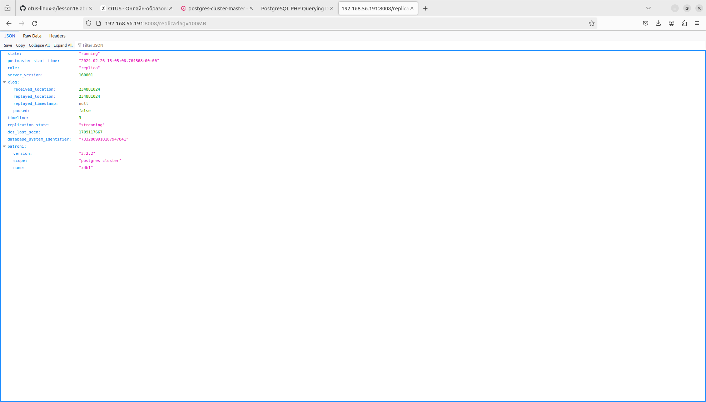

## Демонстрационный стенд PostgreSQL High-Availability Cluster на базе Patroni и Consul на 4 виртуальных машинах.

Данный vagrant-стенд развёртывает 4 виртуальных машин с использованием провайдера Vagrant.
Внутри виртуальных машин с помощью ansible развёртывается PostgreSQL High-Availability Cluster на базе Patroni и Consul.

  
### Используемые инструменты:
  - Virtual Box
  - Vagrant
  - Ansible
  - Ubuntu 20.04
  - PostgreSQL
  - Patroni
  - Consul
  - NGINX
  - php-fpm

 
 
### Порядок запуска:
```
git clone <this repo>
Скачать consul_1.15.8_linux_amd64.zip и положить в:
  roles/consul/files
  roles/test_nginx_frontend/files
ansible-galaxy install -r roles/consul/requirements.yml
vagrant up - поднимется PostgreSQL High-Availability Cluster на базе Patroni и Consul
ansible-playbook test_sample_db.yml - развернется тестовая база 
ansible-playbook test_nginx_frontend.yml - поднимется nginx с тестовым php приложением
```

### Комментарии:
За основу взят плэйбук https://github.com/vitabaks/postgresql_cluster/tree/master по типу C:


#### Адреса захардкожены в [inventory](inventory) и соответствуют следующей таблице:

| IP адрес        | Имя машины        | Коммент      |
|-----------------|-------------------|--------------|
| 192.168.56.191  | xdb1              |cluster member|
| 192.168.56.192  | xdb2              |cluster member|
| 192.168.56.193  | xdb3              |cluster member|
| 192.168.56.194  | nginx1            |frontend      |


#### После выполнения всех плэйбуков необходимо по адресу https://192.168.56.194/postgresqlphpconnect/index.php отобразится запрос к базе:

#### При отображении состояния кластера по адресу  http://192.168.56.194:8500/ui/dc1/services/postgres-cluster/instances/xdb2/postgres-cluster-master/health-checks видно, что  Service 'postgres-cluster' не проходит check:

#### Хотя на самой ноде:

Вероятно баг в клонированной версии https://github.com/vitabaks/postgresql_cluster/tree/master - причину выяснить пока не удалось.
#### После выключения одной ноды:

#### Веб сервер продолжает выполнять запрос к базе

  
  

