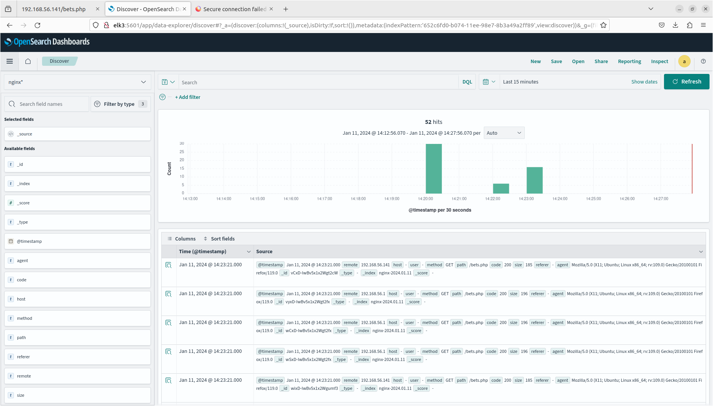

### Демонстрационный стенд nginx_php-fpm_mysql c балансировкой (nginx) и использованием VRRP + сбор nginx access логов (fluenbit-opensearch)  на 8 виртуальных машинах.

Данный vagrant-стенд развёртывает 8 виртуальных машин с использованием провайдера Vagrant.
Внутри виртуальных машин с помощью ansible развёртывается nginx_php-fpm_mysql c балансировкой (nginx) и использованием VRRP.

  
##### Используемые инструменты:
  - Virtual Box
  - Vagrant
  - Ansible
  - Ubuntu 20.04
  - MySQL
  - NGINX
  - php-fpm
  - keepalived
  - fluenbit
  - opensearch
 
 
##### Порядок запуска:
```
git clone <this repo>
vagrant up
ansible-playbook nginx_mysql_install.yml -i ./inventorys/dev
ansible-playbook opensearch_install.yml -i ./inventorys/dev
asible-playbook fluent_bit_install.yml -i ./inventorys/dev
```

##### Комментарии:
  За основу взят плэйбук домашнего задания: https://github.com/astribog/otus-linux-a/tree/master/lesson8
    И https://github.com/hamnsk/common-playbooks/tree/main ,  адаптированный под Vagrant и nginx (2 сетевых адаптера, access.log)
  Адреса для плэйбука nginx_mysql_install.yml захардкожены в [hosts](inventorys/dev/hosts), [keepalived.conf](roles/nginx_frontend/files/keepalived_master_nginx.conf) и соответствуют следующей таблице:

| IP адрес        | Имя машины        | Коммент      |
|-----------------|-------------------|--------------|
| 192.168.56.150  | sql1.otus.lab     |              |
| 192.168.56.140  |                   | frontend VIP |
| 192.168.56.141  | nginx1.otus.lab   | frontend 1   |
| 192.168.56.142  | nginx2.otus.lab   | frontend 2   |
| 192.168.56.143  | nginx3.otus.lab   | backend 1    |
| 192.168.56.144  | nginx4.otus.lab   | backend 2    |
| 192.168.56.121  | elk1.otus.lab     | os node 1    |
| 192.168.56.122  | elk2.otus.lab     | os node 2    |
| 192.168.56.123  | elk3.otus.lab     | os node 3    |
| 192.168.56.123  | elk3.otus.lab     | kibana       |

После выполнения всех плэйбуков необходимо в кибане обновить пароль юзера fluentbit (взять из secrets/opensearch/dev/fluentbit.opensearch)


   В результате в кибане должен создаться индекс nginx.
  
  
  

