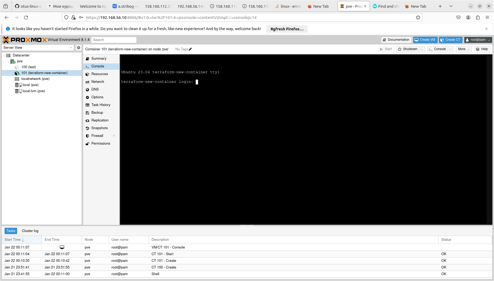

## Поднять proxmox в virtualbox 
## Поднять lxc контейнер в proxmox с помощью terraform


## Пошаговая инструкция

1. Клонируем репу для создания vagrant proxmox base box https://github.com/rgl/proxmox-ve (не заставил работать vbox additions - закоментировал в proxmox-ve/provisioners/provision.sh). В этом репозитории уже присутсвуют склонированные репы с необходимыми изменениями.

```
git clone https://github.com/rgl/proxmox-ve
```
2. Собираем vagrant proxmox base box (около 1ч)
```
cd proxmox-ve
make build-virtualbox
```
3. Добавляем в vagrant собранную proxmox base box 
```
vagrant box add -f proxmox-ve-amd64  proxmox-ve-amd64-virtualbox.box
```
4. Используем Vagrantfile, скрипты из клонированной репы и поднимаем виртуалку c proxmox, адрес зашит в Vagrantfile
```
cd ..
cp proxmox-ve/example/provision.sh proxmox-ve/example/summary.sh .
vagrant up
```
5. Заходим https://192.168.56.10:8006 (root vagrant) и скачиваем lxc template

6. Клонируем репу terraform плагина proxmox и собираем его (ставим GO,если не стоит)
```
git clone https://github.com/Telmate/terraform-provider-proxmox
cd terraform-provider-proxmox/
make
```
7. Добавляем плагин в terraform
```
mkdir -p ~/.terraform.d/plugins/registry.example.com/telmate/proxmox/1.0.0/${PLUGIN_ARCH}
cp bin/terraform-provider-proxmox ~/.terraform.d/plugins/registry.example.com/telmate/proxmox/1.0.0/${PLUGIN_ARCH}/
```
8. Поднимаем lxc контейнер с помощью terraform
```
cd ..
terraform init
terraform validate
terraform plan
terraform apply
```
9. B результате получаем работающщий lxc контейнер в proxmox на virtualbox :)

