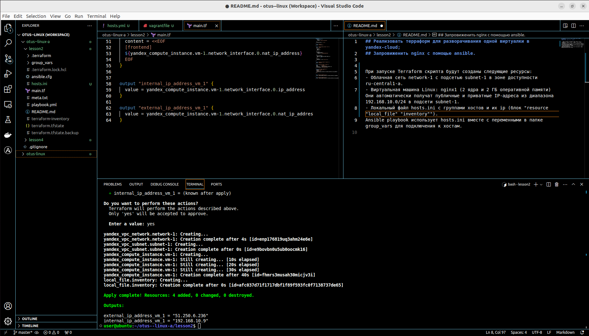
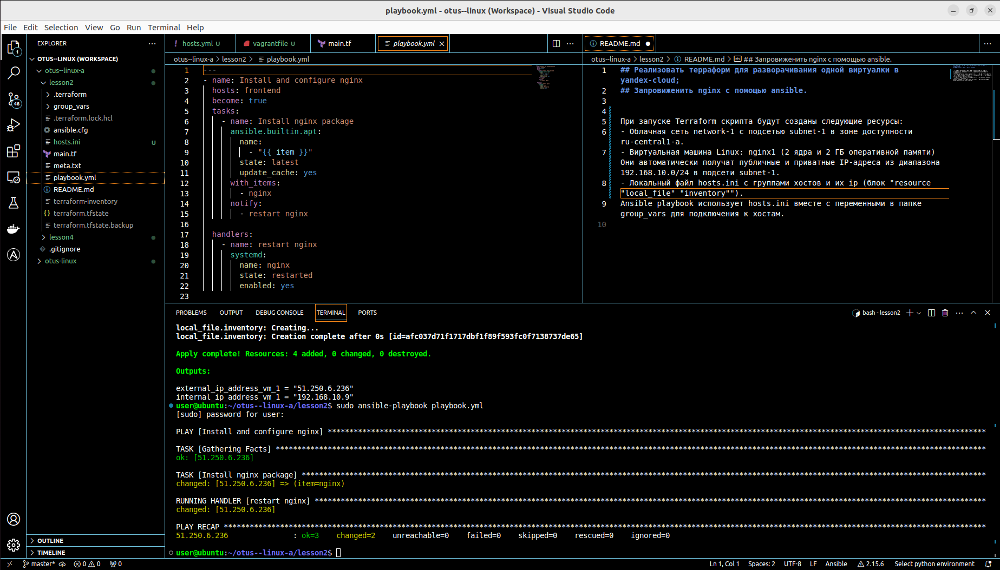
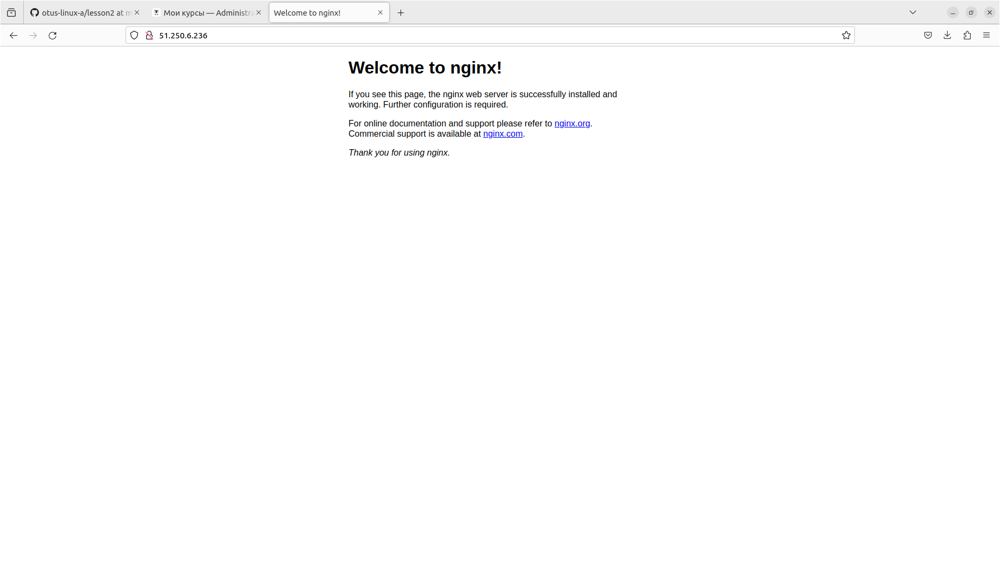

## Реализовать терраформ для разворачивания одной виртуалки в yandex-cloud;
## Запровиженить nginx с помощью ansible.

При запуске Terraform скрипта будут созданы следующие ресурсы:
- Облачная сеть network-1 с подсетью subnet-1 в зоне доступности ru-central1-a.
- Виртуальная машина Linux: nginx1 (2 ядра и 2 ГБ оперативной памяти)  Они автоматически получат публичные и приватные IP-адреса из диапазона 192.168.10.0/24 в подсети subnet-1.
- Локальный файл hosts.ini c группами хостов и их ip (блок "resource "local_file" "inventory"").

При запуске Ansible playbook используется hosts.ini вместe c переменными в папке group_vars для подключения к хостам.

В результате страница nginx доступна по внешнему ip.

