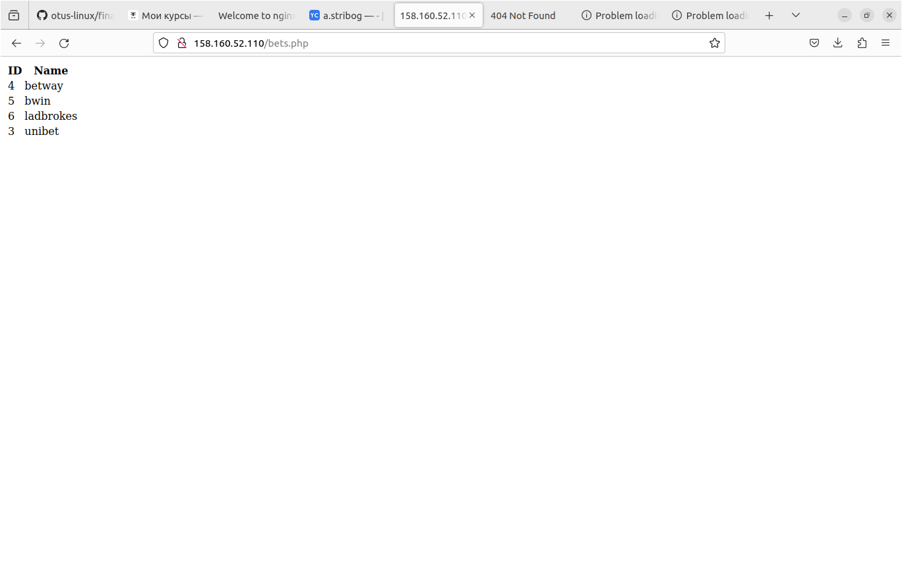

### Демонстрационный стенд nginx_php-fpm_mysql c балансировкой (nginx) на 4 виртуальные машины.

Данный vagrant-стенд развёртывает 4 виртуальные машины с использованием провайдера terraform.
Внутри виртуальных машин с помощью ansible развёртывается nginx_php-fpm_mysql c балансировкой (nginx).

  
##### Используемые инструменты:
  - Terraform + YandexCloud
  - Ubuntu 20.04
  - MySQL
  - NGINX
  - php-fpm
 
 
##### Порядок запуска:
```
git clone <this repo>
terraform apply
ansible-playbook main.yml
```

##### Комментарии:
  
  Внешие IP-адреса для Ansible формируются в процессе выполнения terraform, в hosts.yml. Внутренние захардкожены в  [terraform манифесте](main.tf) и соответствуют следующей таблице:

| IP адрес | Имя машины |
|----------------|---------------|
| 192.168.10.5  | sql1.otus.lab |
| 192.168.10.10 | blnc1.otus.lab |
| 192.168.10.11 | nginx1.otus.lab |
| 192.168.10.12 | nginx2.otus.lab |

  В результате при переходе на "<внешний адрес blnc1>/bets.php" должна отобразиться тестовая таблица из mysql базы.
  
  Отключение бэкэнд нод nginx не должно приводить к падению сайта.
  Данный стенд можно также развернуть и с использование Vagrant. Все необходимое присутствует.    

