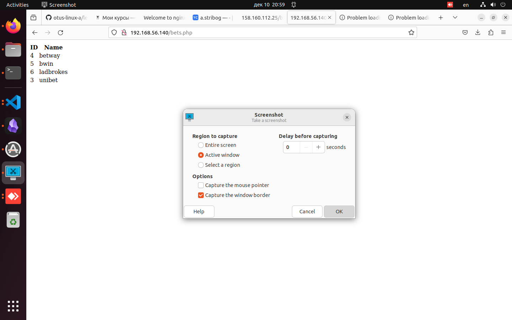

### Демонстрационный стенд nginx_php-fpm_mysql c балансировкой (nginx) и использованием VRRP на 5 виртуальных машинах.

Данный vagrant-стенд развёртывает 5 виртуальных машин с использованием провайдера Vagrant.
Внутри виртуальных машин с помощью ansible развёртывается nginx_php-fpm_mysql c балансировкой (nginx) и использованием VRRP.

  
##### Используемые инструменты:
  - Virtual Box
  - Vagrant
  - Ubuntu 20.04
  - MySQL
  - NGINX
  - php-fpm
  - keepalived
 
 
##### Порядок запуска:
```
git clone <this repo>
vagrant up
```

##### Комментарии:
  
  Адреса захардкожены в hosts.ini и соответствуют следующей таблице:

| IP адрес        | Имя машины        | Коммент      |
|-----------------|-------------------|--------------|
| 192.168.56.150  | sql1.otus.lab     |              |
| 192.168.56.140  |                   | frontend VIP |
| 192.168.56.141  | nginx1.otus.lab   | frontend 1   |
| 192.168.56.142  | nginx2.otus.lab   | frontend 2   |
| 192.168.56.143  | nginx3.otus.lab   | backend 1    |
| 192.168.56.144  | nginx4.otus.lab   | backend 2    |

  В результате при переходе на "<внешний адрес blnc1>/bets.php" должна отобразиться тестовая таблица из mysql базы.
  
  Одновременное отключение 1 бэкэнд и 1 фронтэнд ноды nginx не приводит к падению сайта.
  

